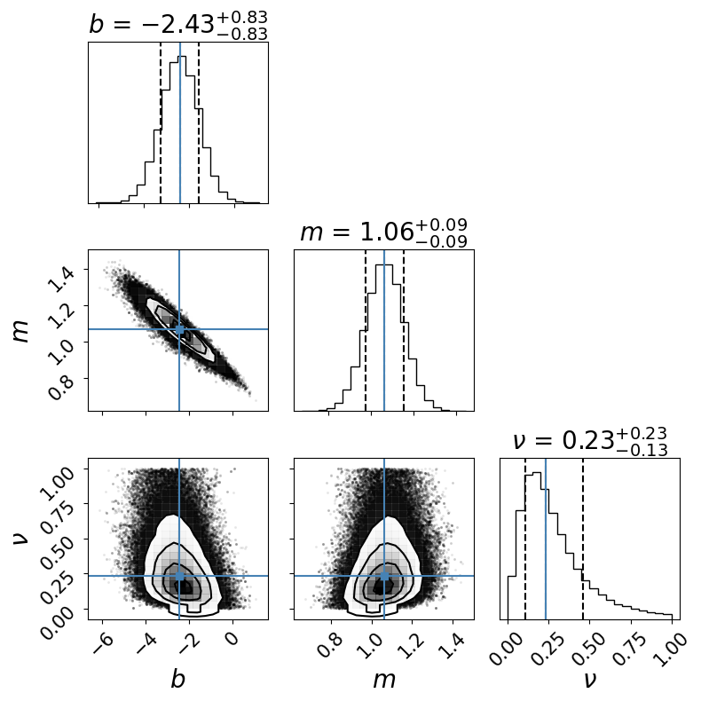
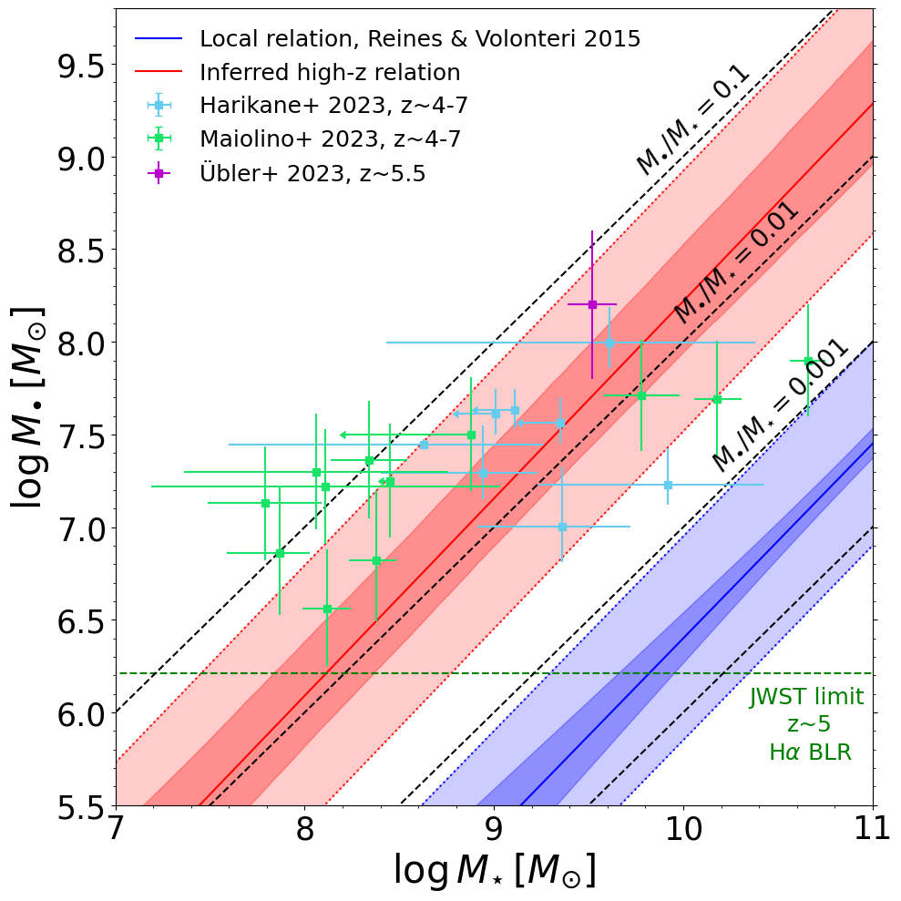

# BH-stellar-mass

Repository owner: Bao "Tintin" Nguyen, second author of ["JWST CEERS and JADES Active Galaxies at z = 4–7 Violate the Local Black Hole - Stellar Mass Relation at >3σ"](https://iopscience.iop.org/article/10.3847/2041-8213/ad0158), led by [Fabio Pacucci](https://www.fabiopacucci.com) (Center for Astrophysics | Harvard & Smithsonian).

The Jupyter notebook in this repository is used to infer the supermassive black hole (SMBH) - stellar mass relation
at high redshift (z~5) from recent JWST distant galaxy observations ([Harikane et al. 2023](https://arxiv.org/abs/2303.11946), 
[Übler et al. 2023](https://arxiv.org/abs/2302.06647) and [Maiolino et al. 2023](https://arxiv.org/abs/2308.01230)).
This notebook generates plot 1 and 2 for [Pacucci et al. 2023](https://iopscience.iop.org/article/10.3847/2041-8213/ad0158), published
in the Astrophysical Journal Letters, volume 957, number 1 (October 2023).

The Bayesian inference considers the local (z~0) SMBH - stellar mass relation ([Reines & Volonteri 2015](https://arxiv.org/abs/1508.06274))
as prior, measurement uncertainties of the data points, the sensitivity limit of JWST, and the intrinsic 
scatter of the fit relation. We also estimate the likelihood of JWST in detecting galaxies at different stellar mass 
using the stellar mass function from [Song et al. 2016](https://arxiv.org/pdf/1507.05636.pdf).

Using the Markov chain Monte Carlo algorithm [emcee](https://arxiv.org/pdf/1507.05636.pdf) ([Foreman-Mackey et al.
2013](https://arxiv.org/abs/1202.3665)), we determine that high-redshift SMBHs observed by JWST are significantly overmassive 
with respect to their host galaxy stellar mass, in comparison to the local universe at >3 standard deviation. This result 
cannot be explained by observational bias and uncertainties. The >3 standard deviation violation of the local relation 
highlights the rapid growth of SMBHs in the early universe and supports the theory of SMBH 
formation through the direct collapse of primordial gas clouds (discussed further in [Pacucci et al. 2023](https://iopscience.iop.org/article/10.3847/2041-8213/ad0158).

Below, m and b are the slope and y-intercept of the high-redshift SMBH - stellar mass relation, respectively.
v denotes the orthogonal variance around the relation, representing the intrinsic scatter. The darker shaded regions
denote the fit uncertainty derived from random samplings of the MCMC, while the lighter shaded regions denote
the intrinsic scatter, which characterizes unmodeled astrophysical processes that cause deviation from the relation.

